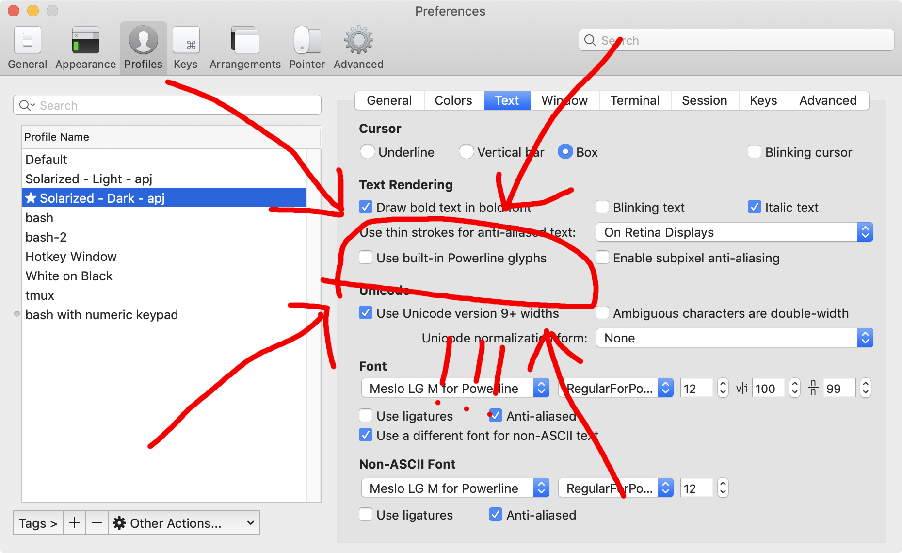

# AgnosterJ User Guide

This is the User Guide for AgnosterJ. This is for people who want to use AgnosterJ in their shell. If you’re a developer and want to know how to hack on AgnosterJ itself, see the [Developer Guide](https://github.com/apjanke/agnosterj-zsh-theme/blob/master/doc/DeveloperGuide.md) instead.

TODO: Put stuff here.

## Installation

### Getting AgnosterJ

You can get AgnosterJ by either:
  * Downloading it from https://github.com/apjanke/agnosterj-zsh-theme/archive/master.zip
  * Cloning the repo from https://github.com/apjanke/agnosterj-zsh-theme

I like to clone the repo, and put it at `~/local/repos/agnosterj-zsh-theme`.

### Setting up AgnosterJ in your shell

Once you have the files on your disk, you need to instruct Zsh to use the theme.

#### Plain Zsh setup

Have your `~/.zshrc` use the `source` command to load the `agnosterj.zsh-theme` file.

```zsh
# This goes in your ~/.zshrc

source ~/path/to/agnosterj-zsh-theme/agnosterj.zsh-theme
```

#### Setup with Oh My Zsh

Link AgnosterJ into your Oh My Zsh custom setup, so it’s visible to Oh My Zsh:

```bash
ln -s ~/local/repos/agnosterj-zsh-theme/agnosterj.zsh-theme $ZSH_CUSTOM/themes/agnosterj.zsh-theme
```

(You may need to set `$ZSH_CUSTOM` and create your Oh My Zsh custom directory first.)

Then set `agnosterj` as your theme in your `~/.zshrc` before loading Oh My Zsh:

```zsh
# This goes in your ~/.zshrc

ZSH_THEME=agnosterj
plugins=( osx themes )
ZSH=${ZSH:-$HOME/.oh-my-zsh}
source $ZSH/oh-my-zsh.zsh
```

#### Setup with Prezto

TODO

### Setting up Powerline

Agnoster uses a special set of characters called the “Powerline icons”, and you must use a special “Powerline-patched” font that supports them. Most fonts do not have these icons!

You can either use a new version of iTerm2, which now has Powerline support built in, or install and use a Powerline-patched font.

#### Using iTerm2

Fire up iTerm2, open your Profile in settings, and turn on “Use built-in Powerline glyphs”. That’s it!



##### Using a Powerline-patched font

You can download Powerline-patched fonts from a couple places:

* [Nerd Fonts](https://www.nerdfonts.com/)
* The [`powerline/fonts` repo](https://github.com/powerline/fonts) on GitHub

I recommend using Nerd Fonts. They’re well packaged, and include other cool symbols, some of which AgnosterJ can also make use of. The particular font I mostly use is the “Meslo LG M NerdFont” font.

If you‘re on a Mac running Homebrew, you can easily install these with Homebrew Cask using the `cask-fonts` tap:

```bash
brew tap homebrew/cask-fonts
brew cask install font-meslo-nerd-font
```

Install one or more of these fonts on your machine, and then configure your terminal emulator to use them. You might have to set separate “regular font” and “font for non-ASCII characters” items, depending on what terminal emulator program you’re using.

##### Not the fonts-powerline Debian package

There is a Debian package called `fonts-powerline`. This will _not_ work for you! It does not contain Powerline-patched fonts. It only contains small fonts with _just_ the Powerline symbol glyphs. That’s not what you need.

## Configuration

### Customizing your segment list

### Configuration variables

AgnosterJ's behavior can be configured by setting these environment variables.

* `$AGNOSTER_PROMPT_SEGMENTS` - List of segments to include in your prompt.
* `$AGNOSTER_PATH_STYLE` – `full`, `short`, or `shrink` – Controls how the current directory is displayed.
* `$AGNOSTER_DISPLAY_EXIT_STATUS` – If 1, includes the exit status value in the status segment for unsuccessful process exits.
* `$AGNOSTER_CONTEXT_FG`, `$AGNOSTER_CONTEXT_BG` – Override colors for the user/host context segment. Useful if you want to set this on a per-host basis.
* `$AGNOSTER_SEPARATOR_STYLE` – Choose a different separator, if you have a font with the [Powerline Extra](https://github.com/ryanoasis/powerline-extra-symbols) symbols (not just regular Powerline). ([Nerd Fonts](https://github.com/ryanoasis/nerd-fonts) is a good way to get these.)
  * Options: `original`, `curvy`, `angly`, `angly-up`, `flame`, `littleboxes`, `boxes`, `fade`, `hexes`, `lego`, `lego2`, `thingie`
* `$DEFAULT_USER` - A user name you typically log in as, and which should be omitted from the prompt display when you are that user.
* `$VIRTUAL_ENV_DISABLE_PROMPT` – Set this to any nonempty value to disable Python virtualenv/conda env display.
* `$AGNOSTER_RANDOM_EMOJI_EACH_PROMPT` – Whether the `prompt_random_emoji` segment should use a different emoji each time a prompt is displayed (1) or keep the same emoji for the duration of a shell session (0).
* `$AGNOSTER_RANDOM_EMOJI` – The list of emoji characters that `prompt_random_emoji` will draw from.
* `$AGNOSTER_RANDOM_EMOJI_REALLY_RANDOM` – Set to `1` to get a wider range of random emoji.

You can call the `agnoster_setopt` function to see what the current variables affecting AgnosterJ are set to.

## Segments

Here are all the segments that AgnosterJ defines.

TODO: Fill this in.

### `status`

### `git`

### `context`

### `virtualenv`

Configuration variables: `$VIRTUAL_ENV_DISABLE_PROMPT`.

### `dir`

Displays the current working directory.

Configuration variables: `$AGNOSTER_PATH_STYLE`.

### `newline`

Outputs a newline. Use this segment to break the prompt into multiple lines.

### `blank`

Just a blank space. Useful in conjunction with `newline` for formatting things.

### `k8s`

### `aws`

### `azure`

### `gcp`

### `filesystem`

### `random_emoji`

Displays a random emoji character, selected from either a predefined list, or a wide range of the emoji Unicode range.

Configuration variables: `$AGNOSTER_RANDOM_EMOJI`, `$AGNOSTER_RANDOM_EMOJI_EACH_PROMPT`, `$AGNOSTER_RANDOM_EMOJI_REALLY_RANDOM`.